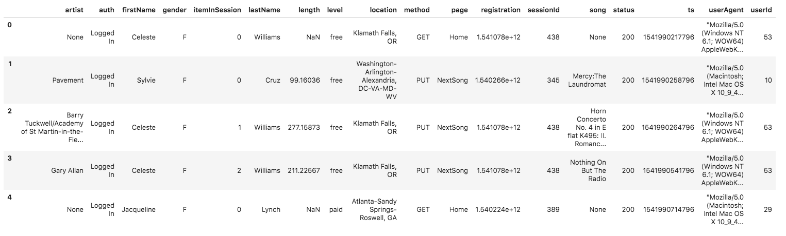
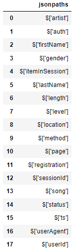

# Description
This project sets up an ETL pipeline using AWS Redshift for data warehousing. The pipeline extracts data from S3, stages it in Redshift, and transforms it into a star schema for efficient querying and analysis. The template includes four key scripts:

## Files and their Purpose
 - `create_table.py`. This script is responsible for creating fact and dimension tables in Redshift. These tables are designed based on the star schema to ensure optimal performance and scalability for analytical queries.
 - `dwg.example.cfg`. Configuration file template for storing credentials and settings for the `etl.py` script.
 - `etl.py`. This script handles the Extract, Transform, Load (ETL) process. It extracts data from S3, stages it in Redshift, and then processes it into the analytics tables. The goal is to ensure data integrity and optimize the loading process for large datasets.
 - `sql_queries.py`. This script contains the SQL statements required for the ETL process. It includes queries for creating tables, inserting data, and performing the necessary transformations. These queries are imported and utilized in the create_table.py and etl.py scripts.
  - `generate_report_examples.py`. The script generates report examples and places them into the [reports_examples folder](./reports_examples/) might be used for analytics.

### Project Structure
The project is organized to facilitate a seamless ETL process, from data extraction to final analytics-ready tables. Here’s a high-level overview of the steps involved:
 1. Data Extraction
 Data is extracted from S3, ensuring it’s accessible and ready for processing.
 2. Staging Tables
 Extracted data is loaded into staging tables in Redshift. This intermediate step allows for data cleansing and transformation without affecting the final tables.
 3. Transformation and Loading
 Data is transformed into the desired schema (fact and dimension tables) and loaded into Redshift. This step includes applying business logic and ensuring data quality.

# Running the Pipeline
To run the ETL pipeline, follow these steps:
1. Make sure have AWS Redshift cluster setup and run. **NOTE**: setup implies correct IAM role for the cluster so it can access udacity s3 buckets.
2. Ensure you have python version 3.11.4 (other might also work).
3. Create `dwh.cfg` file from `dwg.example.cfg` template and set your AWS credentials and Redshift configuration settings as needed.
4. Run `etl.py` to load and transform the data from S3 into your Redshift tables.

# Development
## DB schemas
**Fact Table**

 1. **songplays** - records in event data associated with song plays i.e. records with page `NextSong`
    - *songplay_id, start_time, user_id, level, song_id, artist_id, session_id, location, user_agent*

**Dimension Tables**

 2. **users** - users in the app
    - user_id**, first_name, last_name, gender, level
 4. **songs** - songs in music database
    - song_id, title, artist_id, year, duration
 5. **artists** - artists in music database
    - artist_id, name, location, latitude, longitude
 6. **time** - timestamps of records in songplays broken down into specific units
    - start_time, hour, day, week, month, year, weekday

## Source Data Sets
There are two datasets stored in S3 used in the project.
 - Song data: s3://udacity-dend/song_data
 - Log data: s3://udacity-dend/log_data

To properly read log data s3://udacity-dend/log_data, you'll need the following metadata file:
 - Log metadata: s3://udacity-dend/log_json_path.json


### Song Dataset
```json
{
  "num_songs": 1,
  "artist_id": "ARJIE2Y1187B994AB7",
  "artist_latitude": null,
  "artist_longitude": null,
  "artist_location": "",
  "artist_name": "Line Renaud",
  "song_id": "SOUPIRU12A6D4FA1E1",
  "title": "Der Kleine Dompfaff",
  "duration": 152.92036,
  "year": 0
}
```

### Log Dataset
The log files in the dataset you'll be working with are partitioned by year and month. For example, here are file paths to two files in this dataset.

    log_data/2018/11/2018-11-12-events.json
    log_data/2018/11/2018-11-13-events.json

And below is an example of what a single song file, `2018-11-12-events.json`, looks like.



### Log JSON Metadata
The `log_json_path.json` file is used when loading JSON data into Redshift. It specifies the structure of the JSON data so that Redshift can properly parse and load it into the staging tables.

Below is what data is in log_json_path.json.

Contents of `log_json_path.json`
